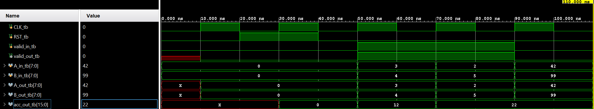
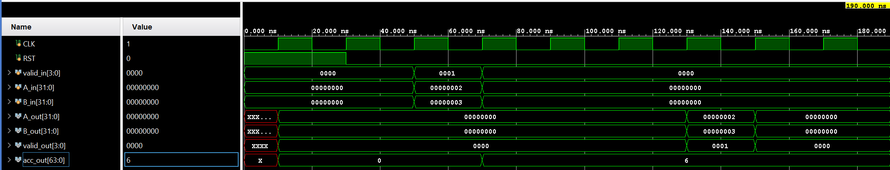
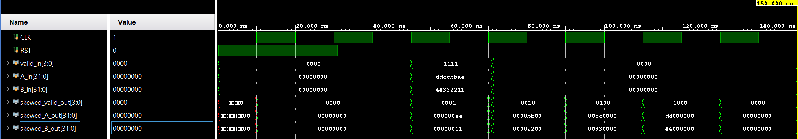
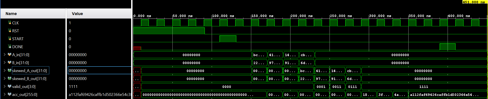

# Parameterized INT8 Systolic Array AI Accelerator

A parameterized NxN output-stationary systolic array accelerator designed in Verilog HDL for matrix multiplication (C = A x B). The design features an integrated hardware input-skewing network, output-stationary MAC processing elements, a Finite State Machine controller, automated Python verification infrastructure, and full FPGA synthesis closure on AMD Xilinx Kintex-7.

---

## Key Highlights

**Parameterized Architecture**: Fully configurable grid size (N), data width (`DATA_W`), and accumulator bit-width (`ACC_W`). Tested at N = 4, INT8 operands, and 32-bit packed bus interfaces.
**Hardware Input Skewing**: On-chip shift-register network skewing row and column streams dynamically to streamline dataflow without off-chip delay logic.
**Automated Verification**: Python golden model generating deterministic test matrices and verification scripts reading hardware simulation dumps via `$readmemh`.
**Timing Closure**: Fully routed on Xilinx Kintex-7 (`xc7k70tfbv676-1`) achieving **+3.156 ns WNS** (**146.11 MHz** F_max).

---

## System Architecture

The systolic accelerator consists of four primary structural blocks:
1. Controller FSM: Manages matrix multiplication execution states (`IDLE`, `CLEAR`, `COMPUTE`, `OUTPUT_VALID`).
2. Input Skew Network: Delays A_in row i by i cycles and B_in column j by j cycles using delay pipelines.
3. Systolic Compute Mesh: NxN grid of Processing Elements propagating operands horizontally ($A$) and vertically ($B$).
4. Processing Element (PE): Pipelined Multiply-Accumulate unit with registered operand forwarding.

                  B_in[0]       B_in[1]       B_in[2]       B_in[3]
                     │             │             │             │
                     ▼             ▼             ▼             ▼
               ┌──────────┐  ┌──────────┐  ┌──────────┐  ┌──────────┐
               │ Skew [0] │  │ Skew [1] │  │ Skew [2] │  │ Skew [3] │
               └────┬─────┘  └────┬─────┘  └────┬─────┘  └────┬─────┘
                    │             │             │             │
                    ▼             ▼             ▼             ▼
A_in[0] ─►[Skew 0]─►[ PE0,0 ] ──► [ PE0,1 ] ──► [ PE0,2 ] ──► [ PE0,3 ]
                    │             │             │             │
A_in[1] ─►[Skew 1]─►[ PE1,0 ] ──► [ PE1,1 ] ──► [ PE1,2 ] ──► [ PE1,3 ]
                    │             │             │             │
A_in[2] ─►[Skew 2]─►[ PE2,0 ] ──► [ PE2,1 ] ──► [ PE2,2 ] ──► [ PE2,3 ]
                    │             │             │             │
A_in[3] ─►[Skew 3]─►[ PE3,0 ] ──► [ PE3,1 ] ──► [ PE3,2 ] ──► [ PE3,3 ]

---

## Processing Element (PE) Design (systolic_mac_pe.v)

Each PE computes an output-stationary MAC operation:

acc_reg => acc_reg + A_in x B_in

Operands A and B along with control valid flags are registered on every clock cycle and forwarded to neighboring PEs in the mesh to maintain systolic rhythm.

               B_in , valid_in
                     │
                     ▼
             ┌───────────────┐
  A_in ─────►│  Registers &  ├─────► A_out
             │  MAC Compute  │
             └───────┬───────┘
                     │
                     ▼
               B_out , valid_out

Waveform Verification Highlights (`wave_pe.png`):
    1. Synchronous Accumulator Reset: `RST_tb` clears `acc_out_tb` to `0` at 20 ns.
    2.  Pipelined MAC Execution: At 50 ns, inputs A = 3 and B = 4 compute 3 x 4 = 12. On the following cycle (70 ns), inputs A=2 and B=5 accumulate to 12, 12 + (2 x 5) = 22.
    3.  Registered Operand Forwarding: Input values A and B are registered and forwarded to `A_out_tb` and `B_out_tb` on the subsequent clock edge with zero data corruption.

---

## Systolic Compute Mesh Design (systolic_compute_mesh.v)

The compute engine consists of a structural NxN spatial grid of PEs. Each PE maintains a stationary 32-bit accumulator while forwarding registered 8-bit operands (A horizontally, B vertically) alongside single-bit valid control signals. 

Data streams diagonally through the array mesh, allowing each input element to be reused $N$ times across the spatial grid, significantly reducing external memory bandwidth requirements.

Waveform Verification Highlights (`wave_mesh.png`):
    1. Inter-PE Data Propagation: Inputs A_in = 0x00000002 and B_in  = 0x00000003 drive channel 0 at 60 ns (`valid_in` = `0001`).
    2. Downstream Forwarding: Registered outputs A_out and B_out reflect forwarded operands on the next clock cycle (120 ns) with matching `valid_out` flags (`0001`).
    3. Spatial Accumulation: PE accumulators capture product values (2x3 = 6) directly into packed bus `acc_out[63:0]`.

---

## Input Skew Network Design (input_skew_network.v and skewer_buffer.v)

To synchronize data arrival at downstream PEs in an output-stationary array, input operands must be temporally staggered. The hardware skew network utilizes shift-register delay chains to stagger inputs by row and column index:
    1.  Row i of matrix A is delayed by i clock cycles.
    2.  Column j of matrix B is delayed by j clock cycles.

This ensures that matching operand pairs A_ik and B_kj converge at PE_ij during the exact same clock cycle without requiring external software-driven delay buffers.

Waveform Verification Highlights (`wave_skew.png`):
    1. Simultaneous Packed Input: Parallel packed buses A_in = 0xddccbbaa and B_in = 0x44332211 arrive simultaneously at 60 ns (`valid_in` = `1111`).
    2. Staggered Diagonal Output: Shift registers delay output channels progressively across 4 consecutive cycles:
        A.  Cycle 1 (60 ns): `skewed_valid_out` = `0001` (Byte 0: `0xaa` / `0x11`)
        B.  Cycle 2 (80 ns): `skewed_valid_out` = `0010` (Byte 1: `0xbb` / `0x22`)
        C.  Cycle 3 (100 ns): `skewed_valid_out` = `0100` (Byte 2: `0xcc` / `0x33`)
        D.  Cycle 4 (120 ns): `skewed_valid_out` = `1000` (Byte 3: `0xdd` / `0x44`) 
       
---

## Finite State Machine (FSM) Execution (controller_fsm.v)

The execution lifecycle is governed by a 4-state controller:

    ┌──────────┐
    │  IDLE    │◄─────────────────────────────┐
    └────┬─────┘                              │
         │ START                              │
         ▼                                    │
    ┌──────────┐                              │
    │  CLEAR   │ (Synchronous ACC Reset)      │
    └────┬─────┘                              │
         │                                    │
         ▼                                    │
    ┌──────────┐                              │
    │ COMPUTE  │ (Active Data Streaming)      │
    └────┬─────┘                              │
         │ cycle_counter == (3*N - 1)         │
         ▼                                    │
    ┌──────────┐                              │
    │OUTPUT_VAL│──────────────────────────────┘
    └──────────┘ DONE = 1

1. IDLE: Controller awaits `START` pulse.
2. CLEAR: Asserts `CLEAR_ACC` for 1 clock cycle to clear all NxN accumulators prior to computation.
3. COMPUTE: Enables dataflow into input skew network and tracks cycle latency (3N - 1 cycles).
4. OUTPUT_VALID: Asserts `DONE` pulse, indicating complete matrix product C is stable on output buses.

---

## Top-Level System Integration (systolic_array_top.v)

The systolic_array_top.v module wraps the Controller FSM, Input Skew Network, and Systolic Compute Mesh into a unified accelerator interface. It abstracts internal clock-domain alignment, state transitions, and mesh wiring, presenting a simple control interface to the host system.

### Top-Level Interface & Execution Flow
    1. Data Buses: Accepts packed 32-bit input buses (A_in and B_in) containing N=4 parallel INT8 matrix streams.
    2. Control Flags: Driven by `CLK`, `RST`, and a single-cycle `START` trigger pulse.
    3. Output Interface: Exposes a flattened 256-bit output bus (acc_out[255:0]) representing all N^2 32-bit accumulated matrix cells, gated by a DONE status flag and output `valid_out` lines.

So, when `START` is pulsed high, the wrapper handles accumulator clearing, streams packed vectors through the input skewer, and asserts `DONE` once matrix multiplication completes.

Waveform Verification Highlights (`wave_systolic_array1.png`):
    1. FSM Execution Lifecycle: A single-cycle `START` pulse at 110 ns triggers synchronous accumulator reset followed by active matrix streaming.
    2. Systolic Pipeline Wavefront: Mesh valid signals (valid_out) progressively activate across the grid (`0001` -> `0011` -> `0111` -> `1111`).
    3. Execution Completion: The controller asserts `DONE` at 390 ns, locking the final 4 x 4 result matrix into the 256-bit bus `acc_out` (`0xa112faf69426caffb1d502366e54c31...`).

---

## Verification Methodology

Verification employs a co-simulation flow linking Python software models with Verilog testbenches:

┌──────────────────────┐        Generates Test Vectors       ┌──────────────────────┐
│  golden_model.py     │ ──────────────────────────────────► │  matrix_A/B.txt      │
└──────────┬───────────┘                                     └──────────┬───────────┘
           │ Calculates Expected Matrix C                               │
           ▼                                                            ▼
┌──────────────────────┐       Compares Hardware Output      ┌──────────────────────┐
│   expected_C.txt     │ ◄────────────────────────────────── │  tb_systolic_top.v   │
└──────────────────────┘                                     └──────────────────────┘

1. `golden_model.py` generates pseudo-random input matrices $A$ and $B$, packs them into hex formatted cycle streams, and calculates gold-standard output C = A x B.
2. Verilog testbench loads inputs via `$readmemh`, drives `systolic_array_top`, and dumps execution outputs to `hardware_output.txt`.
3. Automated check script compares simulation results against expected output values with zero error tolerance.

---

## Synthesis & FPGA Implementation Results

Implemented in **AMD Xilinx Vivado 2025.2** targeting Kintex-7 (`xc7k70tfbv676-1`).

### Resource Utilization Summary
| Resource | Used | Available | Utilization % |
| :--- | :--- | :--- | :--- |
| **Slice LUTs** | 1,371 | 41,000 | 3.34% |
| **Slice Registers (FFs)** | 572 | 82,000 | 0.70% |
| **DSP48E1 Blocks** | 0 | 240 | 0.00% |
| **Block RAM (BRAM)** | 0 | 135 | 0.00% |

> *Note on DSP Utilization*: Multipliers (8x8-bit) synthesized into LUT and carry chain logic (`CARRY4`) under default Vivado optimization settings. Larger configurations (N >= 8) can mandate DSP instantiation via synthesize directives.

### Timing Summary
1. **Target Clock Period**: 10.00 ns (100.00 MHz)
2.  **Worst Negative Slack (WNS)**: +3.156 ns
3. **Worst Hold Slack (WHS)**: +0.103 ns
4. **Minimum Clock Period (T_min)**: 10.00 ns - 3.156 ns = 6.844 ns
5. **Maximum Frequency (F_max)**: 146.11 MHz

---

## Architectural Performance Analysis

### Latency and Throughput Metrics (N = 4)
1. **Total Operations**: N^3 = 64 MACs (128 FLOP/OP equivalents).
2. **Latency**: 13 cycles (130.00 ns at 100 MHz, 88.97 ns at 146.11 MHz).
3. **Compute Efficiency**: 4.92 MACs/cycle average across execution pass 16 MACs/cycle peak array capability.
4. **Peak Compute Throughput**: **4.675 GOP/s** at F_max

### Key Architectural Concepts & Trade-offs
1. Spatial Computing vs. Von Neumann Architectures:
   Von Neumann designs suffer from memory bandwidth bottlenecks fetching instructions and operands repeatedly from memory. Systolic arrays stream data across a spatial grid of processing elements, reusing inputs N times across array dimensions and drastically reducing memory access bandwidth.
2. Output-Stationary Dataflow:
   In this design, partial sums remain stationary within PE accumulators while weights/inputs stream through. This minimizes register movement power for high-precision accumulators compared to weight-stationary or input-stationary configurations.
3. Scalability & Bottlenecks:
   A. I/O Routing Bottleneck: Flattened wide output buses (N^2 x ACC_W) scale quadricly with array dimension. For N >= 16 output serialization or AXI4 stream interfaces are required.
   B. Clock Distribution Skew: Large spatial meshes require balanced clock trees to prevent setup/hold violations across array boundaries.

---

## Repository Structure
systolic-array-accelerator/
├── rtl/
│   ├── systolic_mac_pe.v       # Processing Element MAC design
│   ├── systolic_compute_mesh.v # N x N Structural array mesh
│   ├── skewer_buffer.v         # Shift register delay module
│   ├── input_skew_network.v    # Hardware skewing logic
│   ├── controller_fsm.v        # State controller logic
│   └── systolic_array_top.v    # Top-level system wrapper
├── tb
│   ├── tb_systolic_array.v     # Full-system testbench (top-level)
│   ├── tb_pe.v                 # Unit testbench for PE (MAC + forwarding)
│   ├── tb_skew_network.v       # Unit testbench for skewing pipelines
│   └── tb_compute_mesh.v       # Integration testbench for NxN mesh
├── python/
│   └── golden_model.py         # Golden reference model & vector generator
├── constraints/
│   └── timing.xdc              # SDC timing constraints
├── reports/
│   ├── utilization_report.txt  # Vivado resource utilization output
│   └── timing_report.txt       # Vivado timing summary report
└── README.md

## Author and Contact
    1. Developer: Pranav Korkonda
    2. Email: pranavkorkonda2@gmail.com
    3. LinkedIn: https://www.linkedin.com/in/pranav-korkonda-5b2ab7397/
    4. GitHub: https://github.com/pranavkorkonda2
    